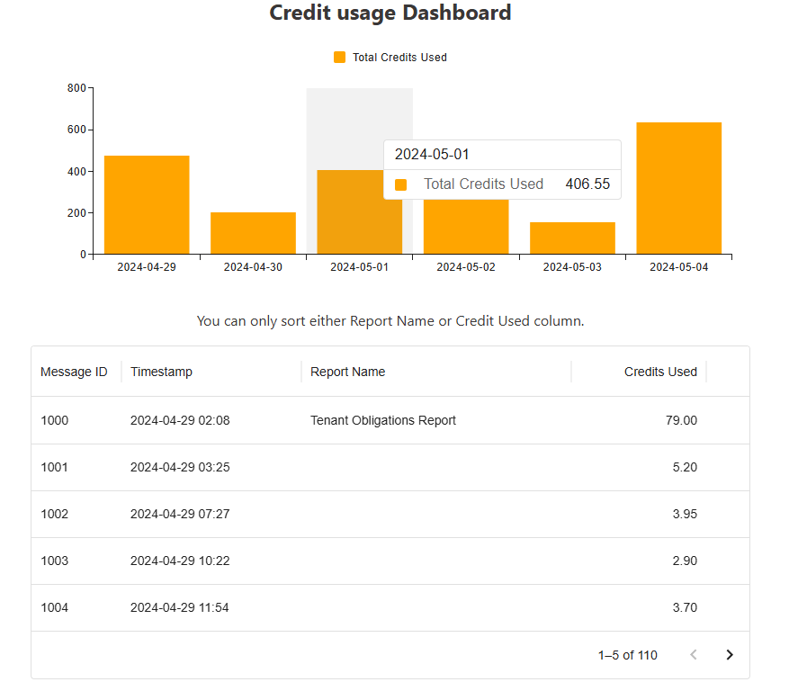

# Orbital - Credit Usage Dashboard

In this project I manage to implement everything except the ability to sort two columns at once on the table due to the time constraint. In terms of how I went about my decision:

1. I used FastAPI for the backend because its lightweight, fast to setup and supports pydantic for model validation. I put more emphasis on the backend because we had to do a lot of calculation for the cost of each message. It's important the calculation is correct, otherwise I could imagine we charge the users wrongly. I added a few unit tests to ensure the credits used calculation is accurate.
2. For the frontend I used vite (build tool) to quickly create a React+Typescript template. The main focus is to quickly create the UI with two core components. I used the Material UI library to help create the bar graph and table since I am familiar with this library.


> When you sort the columns you should be able to copy the URL and paste it in another tab and it should persist the sorted column.

## If I had more time...
Since the project has time constraints, there were I few things I would like to add but did not, for examples:
* Add more validation - particular handling different status code. I would add more detailed error to funnel back to the client.
* Add more tests to the backend. I only added tests to calculate the credit costs for text since its easy to make mistakes with the calculations.
If I had more time I would add integration tests for fetching the data from the API. This will increase more coverage of the codebase.
* Add tests for the frontend such as snapshot tests and integration tests.
* Find alternative solution to create a table with multiple sortable columns

## How to run the backend or the API
Note: this was developed with Python version `3.13`, so using similar version or higher should be fine.
FASTApi and Pytests dependencies are only supported by python 3.8 onwards.

Go to the backend directory:
```
cd backend
```
Create the virtual environment. This command should be available as long as you have Python:
``` 
python -m venv .venv
```

Activate the virtual environment:
```
source .venv/bin/activate 

.venv\Scripts\Activate.ps1 # For Windows powershell
```

In case you want to deactivate the virtual env:
```
deactivate
```

You can check if your virtual environment is activate by running this. It should show the path to your current path to the .venv folder
```
which python

Get-Command python # For Windows powershell
```

You should also update pip to prevent any issues with downloading the dependencies later on:
```
python -m pip install --upgrade pip
```

Now install all the dependencies:
```
pip install -r requirements.txt
```


Once you installed the dependencies you can start the FastAPI server:
```
uvicorn app.main:app --reload
```
* You can get the usage via: http://127.0.0.1:8000/usage.
* Also FastAPI comes with swagger (OpenAPI) - generated API doc here: http://127.0.0.1:8000/docs

To run the unit tests:
```bash
pytest
```

## How to run the frontend
Note: This was developed with Node version `v24.0.2`.
On another tab make sure the API server is running.

Change directory:
```bash
cd frontend
```

Make sure to install the node packages:
```bash
npm install
```

Start the React application
```bash
npm run dev
```
Now you can visit: http://localhost:5173/


In case you have any issues make sure to remove `package-lock.json` and `node_modules`. Then try the steps again.
